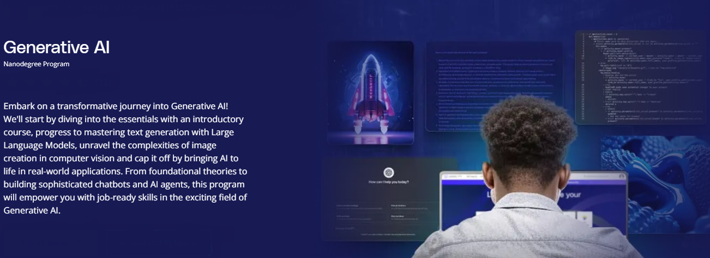
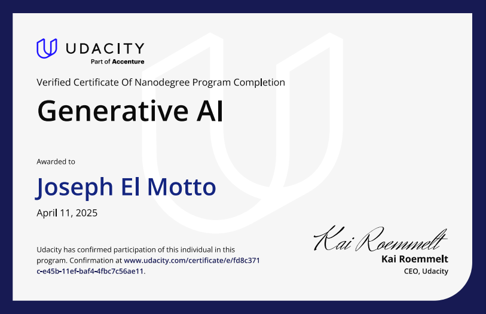

# Generative AI Portfolio

**Udacity Nanodegree Program: Generative AI for Software Developers**

This repository showcases the complete collection of projects completed as part of the Udacity Generative AI Nanodegree program. The projects demonstrate practical applications of generative AI techniques, including foundation model fine-tuning, building custom chatbots, computer vision applications, and personalized AI solutions.

As part of this portfolio, the HomeMatch application has been deployed to 🤗 [Hugging Face Spaces](https://huggingface.co/spaces/Joe-ElM/HomeMatch). This solution delivers personalized real estate recommendations by combining user preferences with generative AI techniques, including vector databases and LLM-based content generation. The deployment demonstrates real-time interaction and the capabilities of generative AI in a practical scenario.

## Program Overview

Embark on a transformative journey into Generative AI. Starting from essential foundations, progressing to mastering text generation with Large Language Models (LLMs), exploring image creation in computer vision, and culminating in building real-world AI applications. From foundational theories to building sophisticated chatbots and AI agents, this program provides job-ready skills in the exciting field of Generative AI.

## Table of Contents

- [Course 1: Welcome to the Program](#course-1-welcome-to-the-program)
- [Course 2: Generative AI Fundamentals](#course-2-generative-ai-fundamentals)
- [Course 3: Large Language Models (LLMs) & Text Generation](#course-3-large-language-models-llms--text-generation)
- [Course 4: Computer Vision and Generative AI](#course-4-computer-vision-and-generative-ai)
- [Course 5: Building Generative AI Solutions](#course-5-building-generative-ai-solutions)

## Course 1: Welcome to the Program

_Introduction only. No project associated with this section._

---

## Course 2: Generative AI Fundamentals

### Project: Apply Lightweight Fine-Tuning to a Foundation Model

This project explores parameter-efficient fine-tuning (PEFT) techniques using the Hugging Face PEFT library and PyTorch. By applying LoRA (Low-Rank Adaptation), the foundation model is adapted to specific tasks efficiently without full-scale fine-tuning.

Key Components:

- Selected and prepared a custom dataset.
- Configured LoRA adapters for the foundation model.
- Trained and saved adapter weights.
- Performed inference with the fine-tuned model.

Project file: `LightweightFineTuning.ipynb`

---

## Course 3: Large Language Models (LLMs) & Text Generation

### Project: Build a Custom Chatbot

Built a custom chatbot application using OpenAI APIs and pandas, without using frameworks, to understand the core mechanics.

Key Components:

- Selected and prepared a dataset.
- Integrated dataset into the chatbot pipeline.
- Built a semantic search and response generation process.
- Demonstrated Q&A performance before and after customization.

Project file: `Project custom chatbot.ipynb`

---

## Course 4: Computer Vision and Generative AI

### Project: AI Photo Editing with Inpainting

Developed an interactive application to edit images by changing either the background or the subject using Segment Anything Model (SAM) and a text-to-image diffusion model.

Key Components:

- Implemented image segmentation using SAM.
- Generated new background or subject based on user input text prompts.
- Connected the inpainting process to a Gradio-powered web interface.

Project file: `starter.ipynb`

---

## Course 5: Building Generative AI Solutions

### Project: HomeMatch - Personalized Real Estate Agent

Created "HomeMatch," an AI application for Future Homes Realty, transforming property listings into personalized narratives tailored to individual buyer preferences.

Key Components:

- Collected user preferences in natural language.
- Embedded property listing data in a vector database.
- Performed semantic search over listings.
- Generated personalized listing descriptions using LLMs.

Project file: `HomeMatch.ipynb`

---

## Skills Demonstrated

- Generative AI fundamentals
- Foundation models and fine-tuning
- Prompt engineering
- Large language models (LLMs)
- Vector databases and semantic search
- Retrieval-Augmented Generation (RAG)
- Computer vision and image inpainting
- Python, PyTorch, Hugging Face
- Building end-to-end AI applications

## Certificate

As recognition of completing the Udacity Generative AI Nanodegree, the following certificate verifies the successful completion of all coursework and projects in this program.

[View Verified Certificate](https://www.udacity.com/certificate/e/fd8c371c-e45b-11ef-baf4-4fbc7c56ae11)

## License

This project repository is for educational and portfolio purposes.

---

For more information about the Udacity Nanodegree Program, visit: [Udacity Generative AI Nanodegree](https://www.udacity.com/course/generative-ai--nd608)
